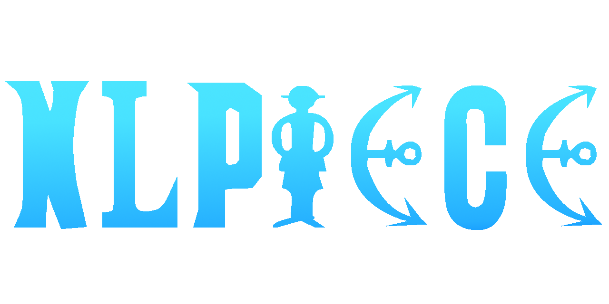

# NLPiece

If you're a One Piece fan, you know that Eiichiro Oda's storytelling 
goes far beyond a rubber-powered pirate—it's a masterpiece of world-building, 
philosophy, and adventure.

This project aims to extract text from every single volume of the *greatest 
story ever told* and dive deep into text analysis using contextual Top2Vec. 
I'll be leveraging the powerful Magi transformer model (repo) to uncover themes, patterns, 
and insights hidden within the pages of One Piece.

To make this even more exciting, I'll do my best to release both the 
dataset and my text analysis to the public—because great stories deserve great exploration. Stay tuned!