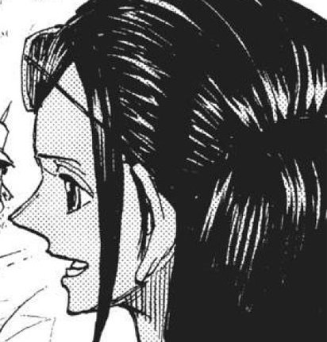

**N**atural **L**anguage **P**rocessing of One P**IECE** is a pretty suggestive name, but let me
simplify it even more: say you wish to investigate topics surrounding the enourmous story of One Piece.
How would you base your affirmations if not on you interpretation of the story?

If you're a One Piece fan, you know that Eiichiro Oda's storytelling 
goes far beyond a rubber-powered pirate, it's a masterpiece of world-building, 
philosophy, and adventure.

**This project aims to extract text from every single volume of the *greatest 
story ever told* (up until Wano arc volume 105) and dive deep into text analysis using contextual [Top2Vec](https://github.com/ddangelov/Top2Vec).**

I'll be leveraging the powerful [MagiV2](https://github.com/ragavsachdeva/magi) transformer model to extract transcripts of the source material, storing everything on a plain text. After that, I'll provide a very extensive analysis using basic stuff, such as tf-idf on volumes and sagas and more complex up to topic modelling and embedding models. 

Not only it'll be possible to agreggate every text into volumes, Magiv2 gives us the possibility to aggregate into a character level! Here is a great example of MagiV2 classification working:


To make this even more exciting, I'll do my best to release both the 
dataset and my text analysis to the public. Stay tuned!

**Disclaimer:** To comply with copyright regulations, I won’t be publicly distributing the manga images I’ve collected. Additionally, I can’t share full transcripts, as that could be considered piracy. All data processed in this project is strictly for **educational purposes**, and any distribution will follow the same principle.

To ensure compliance, all generated datasets will undergo a "sentence destruction" process, preserving the ability to analyze text while preventing direct readability.

# Project Structure

I've developed a simple file structure that may be helpful for anyone trying to replicate what I've done locally or even with a different manga.
It goes as such:

```
.
├── character_images     # This is where I store character images.
│   ├East_Blue           # I found out working with sagas give out a best result in classification.
│   └...
├── data                 # This is where the source files go.
│   ├v001                # They get grouped by volumes.
│   │   ├page1.png        # Each volume has n amount of pages.
│   │   ├page2.png
│   │   └...
│   ├v002
│   └...
├── outputs              # This is where scans are stored after magiv2 does it's magic. (pun intended)
├── readme_files         # The only images I'm currently storing here at github.
├── src                  # Source code and functions.
├── transcripts          # The output of the extraction phase.
│   ├v001
│   │   └transcript.txt
│   ├v002
│   └...
├── pyproject.toml       # Use a pipenv manager to replicate the python modules used. (or even pip itself)
├── README.md            # This document.
└── unpack_manga.sh      # A shell script that I've developed to unzip my mangás into the file system I've explained.
```

# Hardware Specification

**This projects depends heavily on the use of gpu accelerated software**. This means that having a strong GPU is a strong dependency to make things work. I'm personally using a RX6700XT, along with the powerful Ryzen 7 5700X3D, with 16GB of RAM to spare (trust me, I'd be best if I had more).

**If you have an AMD graphics card** (such as me), there is no easy way to run this on the Windows OS. I wish I could say there is a way to make Pytorch work with the use of docker, but there isn't, as docker is a OS level virtualization software, and the windows kernel just simply have a tendency of not working well with ROCm. **My recommendation is running all inside a Linux distro.**

# Notes on character classification

As it is now, Magiv2 lacks on the functionality of clustering similar characters for post classification based on similarity. It solves this issue by using a robust image similarity search that translates a character name from a image bank. 

This approach is very robust when dealing with a small amount of manga pages, but it gets very inconsistent when used on in a large scale and has even bigger challenges when it comes to complex situations in the context of One Piece story.

The way I mitigate these "poor" classifications on this large scale is by sampling and manually classifying a character bank for every major saga of the story. It won't perform *magically*, but it works most of the time.


A huge disclaimer about this feature is that, so far, **there is no way to interpret character context during transcription**. For example, in Punk Hazard ark, characters get their bodies switched by Law's power (a character in the story). It is tricky to represent those characters in manga panels as different person in different body and there is no way magiv2 will correctly assume that, for example, Nami is talking inside Franky's body or vice-versa.

And also, more related to Oda's artstyle, is the big issue of differencing between similar female characters as per example:

  

By using exclusively MagiV2, using both Nami (*left*) and Rebecca (*right*) on the character bank, there will be a lot of intersection on errors to both Nami's transcripts and Rebecca's. 

This will happen a lot during the story. Another good example is Robin and Viola, during the Dressrosa arc.

  

There may be a way of implementing a more robust classification model on top of MagiV2 to deal with those kinds of inconsistencies, but I'm not exploring this any further during the execution of this project. Nonetheless, my solution is simplicity and a bit of manual fine tuning after all of the process finishes executing.

# What I Hope to Achieve with NLPiece

**Natural Language Processing is a common skill on a data scientist toolkit** and I've been using it for years. Through this project, I want to share some of the challenges and possibilities of NLP in a fun and engaging way, showcasing how powerful it can be when applied creatively to textual data.

Beyond that, **NLPiece is a glimpse into how AI can serve a greater purpose**. I believe the future of AI isn’t about replacing workers by automating what we already do. It’s about expanding possibilities and creating solutions that help everyone. One of my biggest **hopes is that, someday, AI-powered tools can allow people with disabilities to experience any manga they want**, with features like entity recognition, panel descriptions, and text transcription. Stories exist to be shared, and everyone deserves to be part of them.

At the end of the day, **I hope this project inspires more professionals to use their skills for the greater good and to build solutions that uplift those who need them most and push AI toward making life better for all of us.**